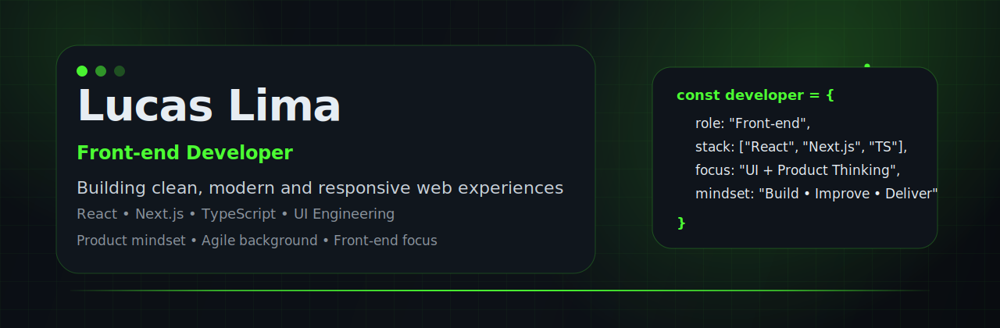
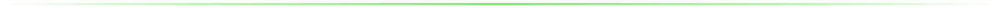
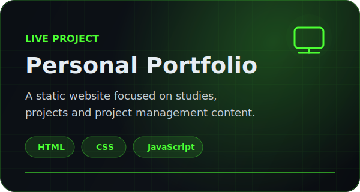
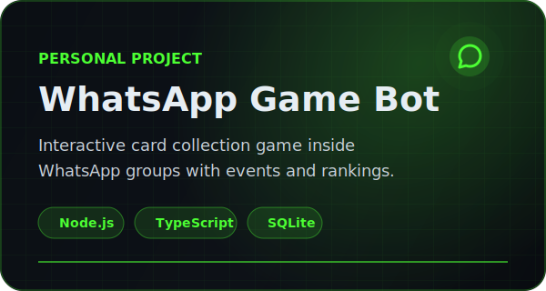

  

 

  

 

  
  
  

 

 

## 👋 About me

I'm **Lucas Lima**, a developer focused on creating clean, responsive and useful web interfaces.

My main focus is **Front-end Development**, working with technologies such as **React**, **Next.js**, **TypeScript**, **JavaScript**, **HTML** and **CSS**. I enjoy building interfaces that are not only visually appealing, but also well-structured, maintainable and connected to real user needs.

Beyond development, I also bring experience with **Agile Project Management**, software delivery, documentation, support routines, bug analysis and team organization. This background helps me think beyond the screen: understanding requirements, improving processes and collaborating better with teams.

I like to build with intention — combining front-end skills, product thinking and a delivery mindset to turn ideas into real solutions.

 

 

## 🚀 Current focus

* Building modern interfaces with **React**, **Next.js** and **TypeScript**
* Improving UI structure, responsiveness and component organization
* Studying better front-end architecture and reusable design patterns
* Creating projects that connect technology, product and real-world use cases
* Applying an agile mindset to improve planning, delivery and documentation

 

## 🚧 Currently Building

  

    Projects and ideas I'm currently improving, experimenting with or preparing to publish.
  

 

<table>
  <tr>
    <td width="50%" valign="top">
      <h3>🌐 Front-end Portfolio</h3>
      

        Improving my personal portfolio as a visual hub for my studies, projects and professional development.
      

      

        <strong>Focus:</strong> HTML, CSS, JavaScript, responsive layout and content organization.
      

      
    </td>
    <td width="50%" valign="top">
      <h3>🎮 GTA Web Project</h3>
      

        Building a web project inspired by GTA-style content, currently focused on structure, layout and visual direction.
      

      

        <strong>Focus:</strong> Front-end practice, UI composition, visual identity and project organization.
      

      
    </td>
  </tr>
</table>

## ⭐ Featured Projects & Labs

  

    A selection of projects and experiments where I combine front-end development, product thinking and delivery experience.
  

 

<table>
  <tr>
   <td width="50%" valign="top">
  

  <h3>🌐 About the project</h3>

  

    A personal portfolio website built with HTML, CSS and JavaScript to present my studies, projects and professional development in technology.
  

  

    <strong>Stack:</strong> HTML, CSS, JavaScript
  

  

    <strong>Focus:</strong> Front-end practice, project management studies, agile content, documentation and professional positioning.
  

  
</td>
    <td width="50%" valign="top">
      <h3>⚡ Front-end Interface Lab</h3>
      

        A continuous practice space for improving modern interfaces, reusable components and web application structure.
      

      

        <strong>Stack:</strong> React, Next.js, TypeScript, CSS
      

      

        <strong>Focus:</strong> UI patterns, component architecture, responsiveness and clean code.
      

      
    </td>
  </tr>
  <tr>
<td width="50%" valign="top">
  

  <h3>📄 About the project</h3>

  

    A local-first AI documentation lab designed to generate project management documents using local models, structured prompts, templates and automation workflows.
  

  

    <strong>Stack:</strong> Python, Local LLMs, Prompt Engineering, Automation
  

  

    <strong>Focus:</strong> Project documentation, privacy-first workflows, process automation and AI-assisted productivity.
  

  
</td>
    
<td width="50%" valign="top">
  

  <h3>🎮 About the project</h3>

  

    An interactive WhatsApp bot built to run a gamified card collection experience inside groups, using commands, packs, trades, rankings and event-based progression.
  

  

    <strong>Stack:</strong> Node.js, TypeScript, Baileys, SQLite
  

  

    <strong>Focus:</strong> Game logic, chat automation, local persistence and user interaction.
  

  
</td>

  </tr>
</table>

 

## 🛠️ Tech Stack

  

    Technologies and tools I use to build, organize and deliver software projects.
  

 

### Front-end Core

 
 

### Tools & Workflow

 
 

### Databases & Back-end Experience

 

<table>
  <tr>
    <td width="33%" valign="top">
      <h3>🎨 Front-end</h3>
      

        React, Next.js, TypeScript, JavaScript, HTML5, CSS3, responsive layouts and component-based interfaces.
      

    </td>
    <td width="33%" valign="top">
      <h3>🧱 UI & Architecture</h3>
      

        Reusable components, clean structure, styling patterns, interface consistency and maintainable front-end code.
      

    </td>
    <td width="33%" valign="top">
      <h3>🚀 Delivery</h3>
      

        Scrum, Kanban, documentation, planning, team collaboration, process improvement and agile delivery.
      

    </td>
  </tr>
</table>

 

## 🧭 Experience Timeline

  

    A quick view of my path through development, agile teams, support routines and project delivery.
  

 

<table>
  <tr>
    <td width="25%" valign="top">
      <h3>💻 Front-end</h3>
      

        Started building web interfaces with HTML, CSS, JavaScript, React and component-based development.
      

      

        <strong>Focus:</strong> UI, responsiveness and web foundations.
      

    </td>
    <td width="25%" valign="top">
      <h3>🧩 Support & Systems</h3>
      

        Worked with system support, bug analysis, databases, technical documentation and complex software flows.
      

      

        <strong>Focus:</strong> Problem solving, debugging and production routines.
      

    </td>
    <td width="25%" valign="top">
      <h3>⚙️ Full Stack</h3>
      

        Expanded my experience with front-end, back-end, APIs, databases and software maintenance.
      

      

        <strong>Focus:</strong> React, .NET, SQL and integration between systems.
      

    </td>
    <td width="25%" valign="top">
      <h3>📊 Agile & Delivery</h3>
      

        Developed experience with Scrum, PMO routines, documentation, planning, team organization and delivery processes.
      

      

        <strong>Focus:</strong> Collaboration, process improvement and product delivery.
      

    </td>
  </tr>
</table>

 

  
  
  
  

 

 

## 📈 GitHub Insights

  

    A quick look at my GitHub activity, main technologies and coding journey.
  

 

  

 

  

 

 

## 🌎 Let's Connect

  

    Feel free to reach out if you want to talk about front-end development, projects, product ideas or collaboration opportunities.
  

 

  
  
  
  
  

 

  

 

 

  
    Built with focus on clean interfaces, useful products and continuous improvement.
  

 

  

